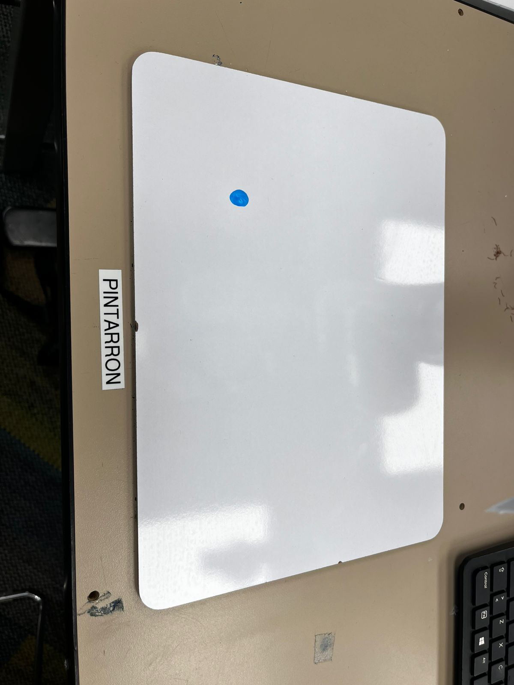
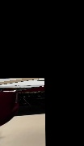

<h1>xArm Control y Visión</h1>

  
  
  

  <strong>Índice</strong>
  <ul>
    <li><a href="#descripción">1. Descripción</a></li>
    <li><a href="#características">2. Características</a></li>
    <li><a href="#capturas-de-pantalla">3. Capturas de pantalla</a></li>
    <li><a href="#estructura-del-proyecto">4. Estructura del proyecto</a></li>
    <li><a href="#requisitos">5. Requisitos</a></li>
    <li><a href="#instalación">6. Instalación</a></li>
    <li><a href="#configuración-del-brazo-xarm">7. Configuración del brazo xArm</a></li>
    <li><a href="#uso">8. Uso</a>
      <ul>
        <li><a href="#1-testconnectionpy">8.1. testConnection.py</a></li>
        <li><a href="#2-controlpy">8.2. control.py</a></li>
        <li><a href="#3-birdviewpy">8.3. birdview.py</a></li>
      </ul>
    </li>
    <li><a href="#personalización-y-ajustes">9. Personalización y ajustes</a></li>
    <li><a href="#contribuir">10. Contribuir</a></li>
    <li><a href="#licencia">11. Licencia</a></li>
    <li><a href="#autores-y-contacto">12. Autores y contacto</a></li>
  </ul>

<h2 id="descripción">1. Descripción</h2>

  Este repositorio, denominado <strong>xArm</strong>, agrupa varios scripts de Python y recursos visuales diseñados para:

<ul>
  <li>Verificar la conexión con un brazo robótico <strong>xArm</strong> (mediante su SDK oficial).</li>
  <li>Enviar comandos de movimiento al xArm (trayectorias, posiciones cartesianas).</li>
  <li>Realizar transformaciones de visión por computadora para obtener una vista cenital (“bird’s-eye view”) de una región de interés.</li>
</ul>

  En conjunto, estos componentes permiten implementar un flujo de trabajo en el que:

<ol>
  <li>Primero se comprueba la comunicación con el robot.</li>
  <li>Se envían posiciones o trayectorias al xArm.</li>
  <li>Se procesa la imagen capturada (por ejemplo, de una cámara externa) para extraer información de perspectiva y luego usarla como retroalimentación visual.</li>
</ol>

<h2 id="características">2. Características</h2>
<ul>
  <li><strong>Conexión sencilla</strong> con el xArm mediante la clase <code>XArmAPI</code> del SDK oficial.</li>
  <li><strong>Control básico por posiciones:</strong> mover el robot en coordenadas (x, y, z, roll, pitch, yaw).</li>
  <li><strong>Transformación de perspectiva (birdview):</strong> detección de contornos blancos y cálculo de homografía para obtener una vista cenital.</li>
  <li><strong>Ejemplos visuales</strong> que permiten validar rápidamente cada funcionalidad.</li>
</ul>

<h2 id="capturas-de-pantalla">3. Capturas de pantalla</h2>

<strong>Ejemplo de imagen de entrada</strong> (<code>test.jpg</code> o <code>test1.jpg</code>):

<strong>Salida generada por <code>birdview.py</code></strong> (<code>birdview_output.jpg</code>):

<h2 id="estructura-del-proyecto">4. Estructura del proyecto</h2>
<pre><code>xarm/
├── LICENSE
├── README.md
├── birdview.py
├── birdview_output.jpg
├── control.py
├── testConnection.py
├── test.jpg
└── test1.jpg
</code></pre>
<ul>
  <li><code>LICENSE</code>   Archivo con la licencia <em>(MIT)</em> del proyecto.</li>
  <li><code>README.md</code>   Documentación principal del repositorio.</li>
  <li><code>testConnection.py</code>   Comprueba la conectividad con el xArm.</li>
  <li><code>control.py</code>   Envía comandos de movimiento al xArm en modo posición.</li>
  <li><code>birdview.py</code>   Aplica procesamiento de imagen para transformar un rectángulo blanco en una vista cenital.</li>
  <li><code>test.jpg</code>, <code>test1.jpg</code>   Imágenes de prueba que contienen un rectángulo blanco sobre fondo arbitrario.</li>
  <li><code>birdview_output.jpg</code>   Resultado de la transformación aplicada a <code>test.jpg</code>.</li>
</ul>

<h2 id="requisitos">5. Requisitos</h2>
<ol>
  <li><strong>Sistema operativo compatible</strong>
    <ul>
      <li>Ubuntu 18.04/20.04 o Windows 10/11</li>
      <li>Python 3.5 a 3.13</li>
    </ul>
  </li>
  <li><strong>Dependencias principales</strong>
    <ul>
      <li><code>xarm-python-sdk</code>   SDK oficial de UFACTORY para controlar el brazo xArm. 
        <pre><code>pip install xarm-python-sdk</code></pre>
      </li>
      <li><code>OpenCV (cv2)</code>   Biblioteca de visión por computadora necesaria en <code>birdview.py</code>. 
        <pre><code>pip install opencv-python</code></pre>
      </li>
      <li><code>NumPy</code>   Manejo de arreglos y cálculos de homografía. 
        <pre><code>pip install numpy</code></pre>
      </li>
    </ul>
  </li>
  <li><strong>Dependencias del sistema</strong>
    <ul>
      <li>En distribuciones basadas en Debian/Ubuntu:
        <pre><code>sudo apt-get update
sudo apt-get install python3 python3-venv python3-pip</code></pre>
      </li>
      <li>En Windows: Asegúrate de que Python 3.5+ esté agregado al <code>PATH</code> y que <code>pip</code> esté disponible.</li>
    </ul>
  </li>
</ol>

<h2 id="instalación">6. Instalación</h2>
<ol>
  <li><strong>Clonar el repositorio</strong> 
    <pre><code>git clone https://github.com/JLUAS/xarm.git
cd xarm</code></pre>
  </li>
  <li><strong>Crear y activar un entorno virtual</strong> <em>(opcional, pero recomendado)</em> 
    <pre><code>python3 -m venv venv
source venv/bin/activate      # Linux/macOS
venv\Scripts\activate.bat     # Windows</code></pre>
  </li>
  <li><strong>Instalar dependencias</strong> 
    <pre><code>pip install --upgrade pip
pip install xarm-python-sdk numpy opencv-python</code></pre>
  </li>
  <li><strong>Verificar instalación</strong> 
    Ingresa a la consola de Python y prueba:
    <pre><code>>> import cv2
>>> import numpy as np
>>> from xarm.wrapper import XArmAPI
>>> print(cv2.__version__)</code></pre>
    Si no aparece ningún error, la instalación fue exitosa.
  </li>
</ol>

<h2 id="configuración-del-brazo-xarm">7. Configuración del brazo xArm</h2>
<ol>
  <li><strong>Red local</strong>
    <ul>
      <li>El xArm debe estar conectado a la misma red local (Wi-Fi o Ethernet) que la máquina donde ejecutarás los scripts.</li>
      <li>Obtén la dirección IP asignada al control box del xArm (por defecto suele ser algo como <code>192.168.1.xxx</code>).</li>
    </ul>
  </li>
  <li><strong>Seguridad y calibración</strong>
    <ul>
      <li>Asegúrate de que el brazo esté calibrado y sin alarmas activas.</li>
      <li>Verifica que no haya obstáculos en el espacio de trabajo del robot.</li>
      <li>Si el xArm tiene modo teaching (enseñar a mano), desactívalo para que acepte comandos por API.</li>
      <li>Consulta el manual de UFACTORY para pasos específicos de calibración si es necesario.</li>
    </ul>
  </li>
  <li><strong>Permisos de red (Windows)</strong>
    <ul>
      <li>Si usas Windows, autoriza la comunicación de Python y del xArm SDK mediante el firewall.</li>
      <li>Permite el tráfico en el puerto predeterminado (5000 o 502) según la documentación del SDK.</li>
    </ul>
  </li>
</ol>

<h2 id="uso">8. Uso</h2>

  A continuación, se describen brevemente los scripts principales y ejemplos de ejecución.

<h3 id="1-testconnectionpy">8.1. <code>testConnection.py</code></h3>

  Este script verifica que puedas conectar con el xArm. Úsalo <strong>antes</strong> de cualquier otro script de control.

<pre><code>python testConnection.py --ip 192.168.1.100</code></pre>
<ul>
  <li><code>--ip</code>: Dirección IP del xArm en tu red local.</li>
  <li>Salida esperada: Mensaje que confirme la conexión exitosa o un error de timeout/denegación.</li>
</ul>

  Si el script imprime algo como:

<pre><code>Conexión exitosa a xArm en 192.168.1.100</code></pre>

entonces el brazo está listo para recibir comandos.

<h3 id="2-controlpy">8.2. <code>control.py</code></h3>

  Envía comandos básicos de movimiento al xArm. El flujo general dentro del script es:

<ol>
  <li>
    Importar <code>XArmAPI</code> y crear una instancia: 
    <pre><code>arm = XArmAPI('192.168.1.100')</code></pre>
  </li>
  <li>
    Habilitar motores y establecer modo de control por posiciones: 
    <pre><code>arm.motion_enable(enable=True)
arm.set_mode(0)        # Modo posición
arm.set_state(0)       # Estado “Ready”</code></pre>
  </li>
  <li>
    Enviar una posición en coordenadas (<code>x, y, z, roll, pitch, yaw, velocidad</code>): 
    <pre><code>arm.set_position(x, y, z, roll, pitch, yaw, speed)</code></pre>
  </li>
  <li>
    Cerrar la conexión al finalizar: 
    <pre><code>arm.disconnect()</code></pre>
  </li>
</ol>

<strong>Ejemplo de ejecución:</strong>

<pre><code>python control.py --ip 192.168.1.100 --x 300 --y 0 --z 200 --roll 0 --pitch 180 --yaw 0 --speed 50</code></pre>
<ul>
  <li><code>--x, --y, --z</code>: Coordenadas (en mm) de la posición deseada.</li>
  <li><code>--roll, --pitch, --yaw</code>: Orientación (en grados).</li>
  <li><code>--speed</code>: Velocidad de movimiento (0–100).</li>
</ul>

<em>Nota:</em> Dentro de <code>control.py</code> hay ejemplos comentados para enviar trayectorias o secuencias de puntos. Ajusta los valores según tu aplicación.

<h3 id="3-birdviewpy">8.3. <code>birdview.py</code></h3>

  Transforma una imagen de entrada (con un rectángulo blanco) en una vista cenital de la región detectada. El flujo es:

<ol>
  <li>
    Cargar la imagen: 
    <pre><code>image = cv2.imread('test.jpg')</code></pre>
  </li>
  <li>
    Convertir a escala de grises y binarizar para aislar píxeles blancos: 
    <pre><code>gray = cv2.cvtColor(image, cv2.COLOR_BGR2GRAY)
_, thresh = cv2.threshold(gray, 200, 255, cv2.THRESH_BINARY)</code></pre>
  </li>
  <li>Detectar contornos y seleccionar el de área máxima (se asume que es el rectángulo blanco).</li>
  <li>Obtener las cuatro esquinas con <code>cv2.minAreaRect</code> y <code>cv2.boxPoints</code>.</li>
  <li>Definir puntos destino (por ejemplo, rectángulo de ancho <code>W</code> y alto <code>H</code>).</li>
  <li>
    Calcular la matriz de homografía y aplicar <code>cv2.warpPerspective</code>.
  </li>
  <li>Guardar o mostrar la imagen resultante.</li>
</ol>

<strong>Ejemplo de ejecución:</strong>

<pre><code>python birdview.py --input test.jpg --output birdview_output.jpg --width 500 --height 700</code></pre>
<ul>
  <li><code>--input</code>: Ruta de la imagen original (p. ej. <code>test.jpg</code>).</li>
  <li><code>--output</code>: Ruta donde se guardará la vista cenital resultante.</li>
  <li><code>--width, --height</code>: Dimensiones deseadas de la imagen final en píxeles.</li>
</ul>

El archivo <code>birdview_output.jpg</code> muestra cómo queda el rectángulo “desplegado” en perspectiva cenital.

<h2 id="personalización-y-ajustes">9. Personalización y ajustes</h2>
<ul>
  <li>
    <strong>Dirección IP del xArm</strong> 
    Cambia el parámetro <code>--ip</code> en cada script para apuntar a la IP real de tu dispositivo.
  </li>
  <li>
    <strong>Umbral de binarización en <code>birdview.py</code></strong> 
    Valor fijo actual: <code>200</code> (puede ajustarse en función de la iluminación). 
    Parámetros de color: se podría refinar si el rectángulo no es totalmente blanco.
  </li>
  <li>
    <strong>Dimensiones de la vista cenital</strong> 
    Ajusta <code>--width</code> y <code>--height</code> según la proporción esperada del rectángulo en la escena.
  </li>
  <li>
    <strong>Trayectorias avanzadas (control por waypoints)</strong> 
    Dentro de <code>control.py</code>, puedes programar bucles que iteran sobre una lista de puntos (<code>x, y, z, roll, pitch, yaw</code>).  
    Incluso, integrarlo con la salida de <code>birdview.py</code> para implementar control visual-servo:
    <ul>
      <li>Capturar imagen.</li>
      <li>Procesar homografía.</li>
      <li>Calcular la posición objetivo en coordenadas reales.</li>
      <li>Enviar actualización al xArm.</li>
    </ul>
  </li>
  <li>
    <strong>Capturas en tiempo real</strong> 
    Si tienes una cámara montada en el xArm o un sensor externo, puedes modificar <code>birdview.py</code> para leer desde el stream en vez de un archivo estático:
    <pre><code>cap = cv2.VideoCapture(0)  # Cambia el índice según tu dispositivo</code></pre>
  </li>
</ul>

<h2 id="contribuir">10. Contribuir</h2>

Las contribuciones son bienvenidas:

<ol>
  <li>Abre una <strong>issue</strong> describiendo la funcionalidad nueva o el bug.</li>
  <li>Crea una rama (<strong>branch</strong>) con un nombre descriptivo (p. ej. <code>feature/omnidirectional-movement</code>).</li>
  <li>Sigue la convención de estilo de Python (PEP 8) y agrega comentarios explicativos.</li>
  <li>Incluye ejemplos de entrada/salida y, si es posible, pruebas unitarias (p. ej., con <code>unittest</code> o <code>pytest</code>).</li>
  <li>Envía un <strong>pull request</strong> y describe los cambios en el mensaje asociado.</li>
</ol>

<h2 id="licencia">11. Licencia</h2>

  Este proyecto se distribuye bajo la licencia <strong>MIT License</strong>. 
  Para más detalles, consulta el archivo <a href="./LICENSE">LICENSE</a>.

<h2 id="autores-y-contacto">12. Autores y contacto</h2>
<ul>
  <li>
    <strong>Jose Luis Urquieta Aguilar</strong> 
    GitHub: <a href="https://github.com/JLUAS">@JLUAS</a> 
    Correo: <em>(tu_email_institucional@dominio.com)</em>
  </li>
  <li>
    Para dudas, sugerencias o reportes de errores, abre una <strong>issue</strong> en este repositorio o envía un correo directamente.
  </li>
</ul>
